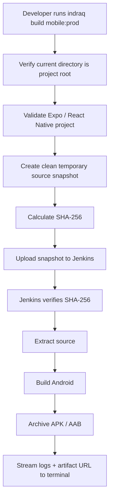

<p align="center">
  
</p>

<h1 align="center">IndraQ CLI</h1>

<p align="center">
  <strong>One command-line tool for IndraQ engineering operations.</strong>
</p>

<p align="center">
  Docker & GHCR deployments · Jenkins automation · Expo / React Native Android builds · Live terminal logs
</p>

<p align="center">
  
  
  
  
  
  
</p>

> [!IMPORTANT]
> **IndraQ CLI is an engineering operations CLI created by IndraQ Innovations.** It is publicly installable from npm. The tool is designed so new internal capabilities can be added as separate modules instead of growing into one giant script.

---

## Index

1. [What is IndraQ CLI?](#what-is-indraq-cli)
2. [Explain it like I am new](#explain-it-like-i-am-new)
3. [What changed in v1.5.5?](#what-changed-in-v155)
4. [Requirements](#requirements)
5. [Install Java 21](#install-java-21)
6. [Install IndraQ CLI](#install-indraq-cli)
7. [Run the doctor](#run-the-doctor)
8. [Configuration home](#configuration-home)
9. [Configure Jenkins](#configure-jenkins)
10. [Configure Docker / GHCR](#configure-docker--ghcr)
11. [Configure Mobile App](#configure-mobile-app)
12. [Docker deployment](#docker-deployment)
13. [Mobile build overview](#mobile-build-overview)
14. [Mobile build matrix](#mobile-build-matrix)
15. [Mobile build commands](#mobile-build-commands)
16. [Mobile build flags](#mobile-build-flags)
17. [Android versioning and artifact names](#android-versioning-and-artifact-names)
18. [How local source reaches Jenkins](#how-local-source-reaches-jenkins)
19. [Root .env behavior](#root-env-behavior)
20. [Mobile Jenkins setup](#mobile-jenkins-setup)
21. [Configuration and secret storage](#configuration-and-secret-storage)
22. [Upgrade from v1.4 / v1.5](#upgrade-from-v14--v15)
23. [Command reference](#command-reference)
24. [Troubleshooting](#troubleshooting)
25. [Frequently asked questions](#frequently-asked-questions)
26. [Project architecture](#project-architecture)
27. [Final checklist](#final-checklist)
28. [License](#license)

---

## What is IndraQ CLI?

IndraQ CLI is a program you install once on a developer computer and then use from **any project folder**.

Instead of remembering many Docker, GitHub, Jenkins, Android, and build commands, you run a small IndraQ command such as:

```bash
indraq deploy:dev
```

or:

```bash
indraq build mobile:staging
```

The CLI validates the request, uses the saved configuration for the current project, performs the work, and shows failures directly in the same VS Code terminal.

### One installation, many projects

Install globally once:

```bash
npm install -g indraq_cli
```

Then use it anywhere:

```text
C:\Projects\accounting-service> indraq deploy:dev
C:\Projects\mobile-app>        indraq build mobile:dev
C:\Projects\another-app>      indraq configure
```

Each project keeps its own `.indraq/` configuration. The CLI itself is not installed separately in every project.

---

## Explain it like I am new

Imagine you built a school project.

You have the project files on your computer. You want another computer called **Jenkins** to build or deploy them for you.

Without IndraQ CLI, you may need to:

1. remember many commands;
2. open Jenkins in the browser;
3. choose the correct job;
4. fill many parameters;
5. copy environment variables;
6. wait for the build;
7. keep refreshing logs.

With IndraQ CLI, you configure the project once and later type one command.

For a mobile app:

```text
Your VS Code project
        │
        │  indraq build mobile:prod
        ▼
IndraQ CLI
        │
        ├── checks you are at the project root
        ├── validates Expo / React Native
        ├── reads the saved Production settings
        ├── reads root .env automatically
        ├── creates a clean source snapshot
        ├── sends it to Production Jenkins
        └── shows Jenkins logs here
                │
                ▼
       Production Jenkins
                │
                ├── installs dependencies
                ├── prepares Android
                ├── builds APK/AAB
                └── publishes the artifact
```

You do **not** need to give Jenkins a Git URL, Git branch, app subdirectory, or pasted `.env` content for this mobile workflow.

---

## What changed in v1.5.5?

v1.5.5 keeps the Android versioning and Jenkins/Git workflow from v1.5.x and hardens Android builds created from Windows source snapshots.

This patch fixes the mobile Jenkinsfile Groovy escaping error, makes the mobile Jenkins job name deterministic, makes project configuration Git-shareable, keeps Jenkins login credentials machine-local, and makes Docker deployments send the exact manual deployment parameters expected by the Jenkins pipeline.


### Jenkins-console-quality logs and server Gradle reuse in v1.5.5

- The terminal log streamer now reads Jenkins **`logText/progressiveHtml`**, the same progressive endpoint used by the classic Jenkins web console. Jenkins therefore removes/renders hidden `ConsoleNote` annotations before the CLI displays the text, so internal `ha:////...` payloads no longer pollute VS Code output.
- HTML markup is converted back to plain terminal text while preserving usernames, timestamps, Pipeline lines, errors, and normal line spacing. `progressiveText` remains only as a compatibility fallback with explicit ConsoleNote filtering.
- Failed mobile builds now end with a short **Key Jenkins error lines** summary plus the direct Jenkins build URL.
- The mobile Jenkinsfile still normalizes Windows CRLF in `android/gradlew`, but v1.5.5 also restores the Jenkins server's shared Gradle cache at `$HOME/.gradle` instead of creating an empty per-project Gradle cache.
- Gradle execution prefers the exact cached project-wrapper distribution. If no exact wrapper distribution is cached, an installed Jenkins-server Gradle from the same major version can be reused. The project wrapper remains the final fallback.
- If a wrapper download is genuinely necessary, the temporary Jenkins copy of `gradle-wrapper.properties` gets `networkTimeout=120000` (120 seconds) instead of failing at Gradle's short default timeout.
- `FULL_RESET` no longer deletes Jenkins' shared Gradle cache. It clears project-local npm/Expo caches and generated Android state only.
- Jenkins queue updates are printed as normal lines instead of carriage-return cursor updates.

### Jenkins/Git behavior hardened in v1.5.x

- Mobile always targets the Jenkins job **`Mobile app Cli build`**. The job name is no longer configurable per project.
- The mobile Jenkinsfile no longer contains the Groovy-invalid escaped-dot expression that caused `unexpected char: '\'` during pipeline compilation.
- Mobile Jenkins HTTP uploads now preserve the Jenkins web-session cookie together with the CSRF crumb, fixing HTTP 403 responses when Jenkins is configured with username/password authentication. API-token authentication remains supported.
- Mobile build output now says explicitly that `.env` is excluded only from the source archive and is uploaded separately to Jenkins.
- `.indraq/mobile.json`, `.indraq/docker.json`, and `.indraq/jenkins.json` are intended to be committed to Git.
- `.indraq/jenkins.local.json`, Jenkins username/token/password, `.env`, and `jenkins-cli.jar` are machine-local and never meant to be committed.
- Docker CLI deployments now start Jenkins with `ACTION=DEPLOY`, `IMAGE_TAG`, optional `IMAGE_DIGEST`, and `DEPLOYMENT_SOURCE=INDRAQ_CLI`.
- Expo versions are synchronized to `app.json` when possible. React Native CLI versions are synchronized to `android/app/build.gradle` / `build.gradle.kts` when those values are simple literals. Jenkins still enforces the requested version during the actual Android build.

### App name is now part of Mobile configuration

Every mobile project stores an app name. IndraQ uses this name when it creates the final APK/AAB filename.

### Android Version and versionCode

New projects start with:

```text
Version:     0.1
versionCode: 1
```

Both counters auto-increment **after a successful Jenkins build** by default. Failed or cancelled builds do not consume a version.

The version rule is simple: the final numeric part increases by one.

```text
0.1   → 0.2
0.9   → 0.10
1.2.3 → 1.2.4
```

`versionCode` increments by one:

```text
1 → 2 → 3 → 4
```

You can change either value or turn either auto-increment switch off from:

```text
indraq configure
  → Mobile App
  → Version & versionCode
```

When auto-increment is disabled, IndraQ does not block the build. It prints a soft warning reminding you that the same value will be reused.

### Predictable Android artifact names

APK/AAB files produced by the IndraQ mobile Jenkinsfile now follow:

```text
<AppName>_<Version>_<versionCode>_<YYYY-MM-DD>_<HHmm>.<apk|aab>
```

Example:

```text
Nefazo_0.1_1_2026-08-30_2051.apk
```

The date/time is always generated in **Asia/Kolkata (IST)**. Time contains hours and minutes only.

### Mobile still always uses Production Jenkins

The Jenkins rule remains intentionally simple:

```text
indraq build mobile:dev     → Production Jenkins
indraq build mobile:staging → Production Jenkins
indraq build mobile:prod    → Production Jenkins
```

Docker continues to support both Development and Production Jenkins:

```text
indraq deploy:dev  → Development Jenkins
indraq deploy:prod → Production Jenkins
```

### Existing v1.4 mobile projects migrate automatically

Existing `.indraq/mobile.json` files are upgraded automatically. Project type, app name, version/versionCode, auto-increment settings, and environment defaults are preserved when present. Older configurable mobile Jenkins job names are removed because mobile now always targets **`Mobile app Cli build`**.

---

## Requirements

### Developer computer

| Requirement | Why | Check |
|---|---|---|
| **Node.js 22+** | Runs IndraQ CLI | `node --version` |
| **npm** | Installs / updates the CLI | `npm --version` |
| **Git** | Docker/GHCR authentication and optional source revision metadata | `git --version` |
| **Docker** | Docker deployment module | `docker --version` |
| **Java** | Runs Jenkins CLI | `java -version` |
| **tar** | Packages the local mobile source snapshot | `tar --version` |
| **Jenkins account** | Starts Jenkins jobs | Jenkins username + API token |

> [!TIP]
> Node.js **24** is recommended for IndraQ developer machines, but v1.5.5 supports Node.js **22 and newer**.

### Jenkins mobile build machine

The provided mobile Jenkinsfile expects the Jenkins agent to have:

- Java;
- Node.js and npm;
- Android SDK;
- `sdkmanager`;
- Bash;
- `tar` / `sha256sum`;
- Jenkins **File Parameter** plugin;
- writable `/opt/mobile-builder`;
- Android SDK at `/opt/android-sdk` unless you edit the Jenkinsfile;
- the Jenkins account should have a writable `$HOME/.gradle` cache (normally `/var/jenkins_home/.gradle`);
- optionally, a system `gradle` executable may be installed. IndraQ uses it only when its major version matches the project wrapper.

---

## Install Java 21

Java is required because Jenkins distributes its CLI as `jenkins-cli.jar`.

### Windows

Open PowerShell:

```powershell
winget install EclipseAdoptium.Temurin.21.JDK
```

Then **fully close and reopen VS Code**.

Verify:

```powershell
java -version
where.exe java
```

### Ubuntu / Debian

```bash
sudo apt update
sudo apt install -y openjdk-21-jdk
java -version
```

### macOS

Using Homebrew:

```bash
brew install --cask temurin@21
java -version
```

> [!IMPORTANT]
> If `java -version` fails, fix Java before running Jenkins configuration.

---

## Install IndraQ CLI

Install globally:

```bash
npm install -g indraq_cli
```

Verify:

```bash
indraq --version
```

Expected for this release:

```text
1.5.3
```

Update later:

```bash
npm install -g indraq_cli@latest
```

Uninstall:

```bash
npm uninstall -g indraq_cli
```

---

## Run the doctor

Before debugging a mysterious machine problem, run:

```bash
indraq doctor
```

It checks:

- Node.js version;
- Java;
- Git;
- `tar`;
- how the `indraq` command resolves on your machine.

This is especially useful on Windows if another file named `IndraQ` is shadowing the npm executable.

---

## Configuration home

Run from the project you want to configure:

```bash
indraq configure
```

You will see:

```text
IndraQ CLI Configuration

? What do you want to configure?
> Jenkins
  Docker / GHCR
  Mobile App
  ------------------------------
  Review current project configuration
  Exit
```

The rule is simple:

> **Persistent settings are changed with `indraq configure`. One-time build changes are supplied as flags.**

---

## Configure Jenkins

Choose:

```text
Configure
  └── Jenkins
```

The Jenkins menu is:

```text
> Development
  Production — used by all mobile builds
  ------------------
  Review Jenkins connections
  Back
```

There are only **two Jenkins infrastructure environments** in a project.

| Jenkins connection | Used by |
|---|---|
| **Development** | `indraq deploy:dev` |
| **Production** | `indraq deploy:prod` **and every mobile build** |

This means:

```text
Mobile Development  ┐
Mobile Staging      ├──→ Production Jenkins
Mobile Production  ┘
```

A command such as `indraq build mobile:dev` means **build the app using its Development mobile settings on Production Jenkins**. It does not mean “use Development Jenkins.”

For each Jenkins connection, IndraQ asks for:

```text
Jenkins URL/domain
Jenkins username
Jenkins API token or password
```

It then:

1. downloads `<jenkins>/jnlpJars/jenkins-cli.jar`;
2. stores the secret outside the project;
3. runs Jenkins `who-am-i`;
4. rejects wrong credentials immediately;
5. saves the verified non-secret connection metadata in `.indraq/jenkins.json`.

Configure Jenkins once per project. Normal Docker/mobile build commands reuse the saved connection and credentials.

Use a Jenkins API token instead of an account password whenever possible.

---

## Configure Docker / GHCR

Choose:

```text
Configure
  └── Docker / GHCR
```

The menu lets you independently change:

```text
Development
Production
GitHub / GHCR destination
Review
Back
```

Development and Production each store:

- image name;
- Dockerfile path.

GitHub/GHCR stores:

- personal account or organization;
- selected GHCR owner.

The Docker deployment Jenkins connection is configured separately under **Jenkins**.

When `indraq deploy:dev` or `indraq deploy:prod` has built and pushed the image, the CLI starts the Jenkins job whose name matches the image repository name (for example `ghcr.io/indraq-innovations/immortality-accounting-service` maps to Jenkins job `immortality-accounting-service`) and supplies exactly:

```text
ACTION=DEPLOY
IMAGE_TAG=<primary pushed tag>
IMAGE_DIGEST=<sha256 digest, when available>
DEPLOYMENT_SOURCE=INDRAQ_CLI
```

This is the CLI path; the Jenkinsfile may still keep its Generic Webhook Trigger for other deployment sources if you want it.

---

## Configure Mobile App

Choose:

```text
Configure
  └── Mobile App
```

The menu is:

```text
> Project settings
  Version & versionCode
  Development
  Staging
  Production
  ------------------
  Review Mobile App configuration
  Back
```

### Project settings

IndraQ asks for:

```text
Mobile app name
Project type
  - Expo
  - React Native CLI
```

The app name is saved per project and is used in the final APK/AAB filename.

The mobile Jenkins job is **not configurable**. Every mobile build targets exactly:

```text
Mobile app Cli build
```

All mobile Development, Staging, and Production builds use the project's **Production Jenkins** connection. The CLI verifies that `Mobile app Cli build` exists before uploading source.

### Version & versionCode settings

Choose:

```text
Mobile App
  → Version & versionCode
```

You can configure these independently:

```text
Version
versionCode
Auto-increment Version
Auto-increment versionCode
```

Defaults:

```text
Version:                    0.1
versionCode:                1
Auto-increment Version:     ON
Auto-increment versionCode: ON
```

Auto-increment happens only after Jenkins reports `SUCCESS`. A failed build leaves both saved values unchanged.

If you manually change Version/versionCode while a Jenkins build is still running, IndraQ will not overwrite your newer values when that build finishes.

### Version values survive Git clones

`.indraq/mobile.json` is project configuration and should be committed. That means another developer who clones/pulls the repository receives the same next Version/versionCode.

IndraQ also synchronizes the configured values into the Android-facing project file when it can do so safely:

```text
Expo             → app.json → expo.version + expo.android.versionCode
React Native CLI → android/app/build.gradle(.kts) → versionName + versionCode
```

Before a remote build, Jenkins applies the requested values again after Expo prebuild / before Gradle, so the artifact uses the values shown in the CLI build plan.

After a successful build with auto-increment enabled, commit the changed `.indraq/mobile.json` and synced app-version file(s). Failed builds do not increment the shared values.

### Environment settings

Each mobile environment stores:

- default build output;
- default build profile.

Profiles:

| Profile | Meaning |
|---|---|
| **FAST** | Fresh source snapshot; reuse project npm cache plus the Jenkins server shared Gradle cache |
| **CLEAN** | Clean generated project build state before building |
| **FULL_RESET** | Clear project npm/Expo/generated Android state while preserving the Jenkins server shared Gradle cache |

After saving one environment you return to the Mobile App menu, so you can configure another environment without rerunning the command.

---

## Docker deployment

Development:

```bash
indraq deploy:dev
```

Alias:

```bash
indraq deploy:development
```

Production:

```bash
indraq deploy:prod
```

Alias:

```bash
indraq deploy:production
```

Docker deployment still follows this flow:

```text
validate Docker / GitHub / Java / Jenkins
        ↓
build Docker image
        ↓
push image to GHCR
        ↓
find Jenkins job with same name as image
        ↓
run Jenkins pipeline
        ↓
stream logs into terminal
```

---

## Mobile build overview

> [!IMPORTANT]
> **Every mobile build runs on the saved Production Jenkins connection.** `mobile:dev`, `mobile:staging`, and `mobile:prod` are mobile application environments, not Jenkins environments.


The mobile module deliberately does **not** ask for:

- Git repository URL;
- Git branch;
- app subdirectory;
- pasted env text;
- "save env" checkbox.

Why? Because the CLI is already running inside the developer's project.

### Root directory rule

Run mobile builds from the directory containing the mobile app's `package.json`.

Correct:

```text
my-mobile-app/
├── package.json       ← run command here
├── .env
├── src/
├── android/           ← React Native CLI
└── ...
```

Wrong:

```text
my-mobile-app/android/ ← do not run it here
```

IndraQ does not silently search parent folders. If `package.json` is not in the current directory, the build stops.

---

## Mobile build matrix

Invalid combinations are blocked both by the CLI **and** by the Jenkinsfile.

| Project type | Environment | Allowed output |
|---|---|---|
| Expo | Development | **Development Client only** |
| Expo | Staging | **Release APK** or **Release AAB** |
| Expo | Production | **Release APK** or **Release AAB** |
| React Native CLI | Development | **Debug APK only** |
| React Native CLI | Staging | **Release APK** or **Release AAB** |
| React Native CLI | Production | **Release APK** or **Release AAB** |

The CLI does not show impossible choices during configuration.

For example, Expo Development automatically becomes:

```text
Build output: Development Client
```

There is no pointless APK/AAB menu for that combination.

---

## Mobile build commands

Development:

```bash
indraq build mobile:dev
```

Alias:

```bash
indraq build mobile:development
```

Staging:

```bash
indraq build mobile:staging
```

Production:

```bash
indraq build mobile:prod
```

Alias:

```bash
indraq build mobile:production
```

### First build

If required mobile configuration is missing, the CLI asks only for the missing settings and saves them.

### Later builds

Once configured:

```bash
indraq build mobile:staging
```

uses the saved Staging output/profile without asking the same questions again.

Before uploading anything, IndraQ prints a build plan and asks for confirmation.

---

## Mobile build flags

Flags override saved defaults **for one build only**.

They do not permanently change `mobile.json`.

### Output override

```bash
indraq build mobile:staging --output aab
```

Accepted output aliases:

```text
dev-client / development-client
debug / debug-apk
apk / release-apk
aab / release-aab
```

The matrix is still enforced. For example, this is rejected:

```bash
indraq build mobile:dev --output aab
```

for an Expo Development project.

### Profile override

```bash
indraq build mobile:prod --profile clean
```

Available profiles:

```text
fast
clean
full-reset
```

### Verbose Gradle logs

```bash
indraq build mobile:prod --verbose
```

### Dry run

Validate everything and print the plan without uploading source or starting Jenkins:

```bash
indraq build mobile:staging --dry-run
```

### Skip final confirmation

Useful for a developer who already knows exactly what will run:

```bash
indraq build mobile:prod --yes
```

Example combination:

```bash
indraq build mobile:prod --output aab --profile clean --verbose --yes
```

---

## Android versioning and artifact names

IndraQ v1.5.5 currently manages **Android** versioning only. iOS version/build-number management is intentionally out of scope for now.

### What value does a build use?

A build uses the values currently stored in `.indraq/mobile.json`.

Example before the build:

```text
Version:     0.1
versionCode: 1
```

The Jenkins build receives exactly `0.1` and `1`, applies them to the generated/native Android Gradle project, and produces the APK/AAB with those values.

Only after Jenkins finishes successfully are enabled counters advanced for the next build.

### Auto-increment examples

With both switches ON:

```text
Build 1 uses: 0.1 / 1
Success
Next saved:   0.2 / 2

Build 2 uses: 0.2 / 2
Success
Next saved:   0.3 / 3
```

If `Auto-increment Version` is OFF:

```text
Version stays 0.1
versionCode may still move 1 → 2 → 3
```

If `Auto-increment versionCode` is OFF, IndraQ prints a warning before every mobile build because Android release stores normally expect a higher versionCode for upgrades.

### Artifact filename

The Jenkins mobile pipeline renames the primary APK/AAB to:

```text
<AppName>_<Version>_<versionCode>_<YYYY-MM-DD>_<HHmm>.<extension>
```

Example:

```text
Nefazo_User_1.4_27_2026-08-30_2051.aab
```

Rules:

- timezone: `Asia/Kolkata` (IST);
- date: `YYYY-MM-DD`;
- time: 24-hour `HHmm`;
- seconds are intentionally omitted;
- unsafe filename characters in the configured app name are replaced with `_`.

---

## How local source reaches Jenkins

This is the mobile source-upload design.

The old mobile Jenkins pipeline cloned a Git URL. The new flow builds the files that are **actually on the developer's computer right now**.



### What is excluded from the source snapshot?

IndraQ excludes common generated/sensitive files such as:

```text
.git/
.indraq/
node_modules/
coverage/
dist/
build/
.vscode/
.idea/
.env
.env.*
*.apk
*.aab
android/.gradle/
android/app/build/
ios/Pods/
```

The source archive is created in the system temporary directory, uploaded, then deleted locally.

### Why SHA-256?

The CLI calculates a SHA-256 hash before upload. Jenkins calculates it again before extraction.

If they do not match, the build stops.

---

## Root .env behavior

You no longer paste `.env` into Jenkins.

For build outputs that need an environment file, IndraQ automatically uses:

```text
<mobile-project-root>/.env
```

The `.env` file is:

1. **not included** inside the source archive;
2. uploaded separately as a Jenkins file parameter;
3. copied into the temporary build source;
4. never printed in logs;
5. removed from the Jenkins workspace in `post { always { ... } }`.

> [!CAUTION]
> Jenkins file parameters can remain in Jenkins build data according to your controller/plugin retention behavior. The workspace copy is deleted, but highly sensitive production secrets should still follow your normal Jenkins retention and secret-management policy.

If a required `.env` is missing, the build stops before source upload.

Expo Development Client does not require `.env`, but if a root `.env` exists IndraQ still supplies it automatically.

---

## Mobile Jenkins setup

The mobile source-upload workflow requires the Jenkins **File Parameter** plugin.

### Step 1 — install the plugin

In Jenkins:

```text
Manage Jenkins
  → Plugins
  → Available plugins
  → search: File Parameter
  → install "File Parameter"
```

Plugin ID:

```text
file-parameters
```

### Step 2 — use the IndraQ v1.5 mobile Jenkinsfile

This repository includes:

```text
templates/jenkins/Jenkinsfile-Mobile-App
```

Use that pipeline for the Jenkins mobile build job.

It declares two large file parameters:

```text
SOURCE_BUNDLE
ENV_FILE
```

plus normal metadata/build parameters supplied automatically by the CLI.

> [!IMPORTANT]
> If you replace an existing Pipeline Jenkinsfile with this one, run/save the job once if Jenkins needs an initial run to register the new parameter definitions. After that the CLI uses `buildWithParameters` automatically.

### Step 3 — Jenkins agent paths

Default paths in the template:

```text
ANDROID_HOME=/opt/android-sdk
ANDROID_SDK_ROOT=/opt/android-sdk
MOBILE_BUILDER_HOME=/opt/mobile-builder
```

Change the Jenkinsfile if your Jenkins agent uses different paths.

### Step 4 — configure the CLI

```bash
indraq configure
```

Configure the Jenkins connection once:

```text
Jenkins
  → Production
```

Enter the Production Jenkins URL, username, and API token. **All mobile Development, Staging, and Production builds use this Production Jenkins connection.**

Then configure the mobile project:

```text
Mobile App
  → Project settings
```

Set the app name and project type. On Jenkins, create/rename the mobile Pipeline job to exactly:

```text
Mobile app Cli build
```

The CLI checks this exact job on Production Jenkins before every mobile build.

### Live logs

Mobile source upload is triggered through Jenkins HTTP `buildWithParameters`, then IndraQ follows the queue item, discovers the build number, and streams Jenkins **`logText/progressiveHtml`** into VS Code. This is the same progressive console endpoint used by the classic Jenkins browser console, so Jenkins' hidden `ConsoleNote` metadata is rendered/removed before IndraQ converts the remaining HTML to readable terminal text.

If Jenkins fails, the CLI exits with failure, prints a short **Key Jenkins error lines** summary, and prints the direct Jenkins build URL. The complete live output remains above it.

---

## Configuration and secret storage

Project-local configuration:

```text
<project>/.indraq/
├── jenkins.json          # shared — commit
├── docker.json           # shared — commit
├── mobile.json           # shared — commit
├── jenkins.local.json    # machine-local — ignored
└── .gitignore
```

The generated `.indraq/.gitignore` ignores **only machine-local files** such as `jenkins.local.json`. Shared project configuration is intentionally visible to Git.

> [!IMPORTANT]
> Older IndraQ setups often ignored the whole `.indraq/` directory. v1.5.5 automatically appends safe re-include rules to the project root `.gitignore` so `jenkins.json`, `docker.json`, and `mobile.json` can be committed while `jenkins.local.json` remains ignored. Run `git status` after configuration and commit the three shared JSON files.

### `jenkins.json`

Stores non-secret Jenkins metadata:

```text
Development Jenkins connection
Production Jenkins connection
```

Usage is fixed and easy to remember:

```text
Docker DEV  → Development Jenkins
Docker PROD → Production Jenkins
Mobile DEV / STAGING / PROD → Production Jenkins
```

It stores Jenkins URL/transport only. It does **not** store Jenkins username, token, or password.

The local `jenkins.local.json` contains only the machine's credential binding ID and is ignored by Git. The actual username + API token/password remain under the user's home directory.

### `docker.json`

Stores:

```text
GitHub / GHCR owner
Development image + Dockerfile
Production image + Dockerfile
```

### `mobile.json`

Stores:

```text
stable project ID
app name
project type
Android Version + versionCode
auto-increment switches for Version + versionCode
Development output/profile
Staging output/profile
Production output/profile
```

It does **not** store `.env` values.

### Jenkins secret location

Jenkins login credentials live outside the repository and never survive a Git clone:

```text
~/.indraq/
└── jenkins/
    └── <server-account-id>/
        ├── jenkins-cli.jar
        └── auth
```

Never commit this directory.

---

## Upgrade from v1.4 / v1.5

Update the public package:

```bash
npm install -g indraq_cli@latest
```

Verify:

```bash
indraq --version
```

Expected for this release:

```text
1.5.3
```

v1.5.5 automatically migrates older `.indraq/mobile.json` and Jenkins config layouts. Existing mobile environment/version settings are preserved. Older Jenkins username/server binding fields are split so only non-secret server metadata remains in tracked `jenkins.json`; the current machine binding is written to ignored `jenkins.local.json`.

For projects coming from pre-versioning releases, Android version settings initialize as:

```text
Version:     0.1
versionCode: 1
Auto Version: ON
Auto versionCode: ON
```

Because v1.5 did not store the configured app name, open:

```text
indraq configure
  → Mobile App
  → Project settings
```

and confirm the app name once.

Docker/GHCR and Jenkins configuration remain compatible.

---

## Command reference

| Command | Purpose |
|---|---|
| `indraq --version` | Show installed CLI version |
| `indraq --help` | Show commands |
| `indraq doctor` | Diagnose runtime / PATH prerequisites |
| `indraq configure` | Open configuration home |
| `indraq deploy:dev` | Docker Development deployment |
| `indraq deploy:development` | Alias of `deploy:dev` |
| `indraq deploy:prod` | Docker Production deployment |
| `indraq deploy:production` | Alias of `deploy:prod` |
| `indraq build mobile:dev` | Mobile Development build |
| `indraq build mobile:development` | Alias of `mobile:dev` |
| `indraq build mobile:staging` | Mobile Staging build |
| `indraq build mobile:prod` | Mobile Production build |
| `indraq build mobile:production` | Alias of `mobile:prod` |

Mobile flags:

```text
--output <dev-client|debug-apk|apk|aab>
--profile <fast|clean|full-reset>
--verbose
--dry-run
-y, --yes
```

---

## Troubleshooting

### `Java is required for Jenkins CLI`

Check:

```bash
java -version
```

Install Java 21 and reopen VS Code.

---

### `tar is required`

Check:

```bash
tar --version
```

Modern Windows 10/11, macOS, and most Linux distributions already provide `tar`.

Ubuntu/Debian:

```bash
sudo apt install -y tar
```

---

### `You are not in a mobile project root`

Run:

```bash
ls
```

or on PowerShell:

```powershell
Get-ChildItem
```

The current directory must contain:

```text
package.json
```

For React Native CLI it must also contain:

```text
android/
android/gradlew
```

---

### `expo-dev-client is not installed`

For Expo Development Client:

```bash
npx expo install expo-dev-client
```

Then retry.

---

### `.env was not found`

Create:

```text
<project-root>/.env
```

Do not paste it into Jenkins.

---

### Jenkins HTTP 400 / file parameter error

Make sure:

1. Jenkins **File Parameter** plugin is installed;
2. the job uses `templates/jenkins/Jenkinsfile-Mobile-App` from v1.5.5;
3. Jenkins has registered the parameters;
4. the Jenkins job is named exactly `Mobile app Cli build`.

---

### Jenkins job not found

For mobile, the job name is fixed. In Jenkins, create or rename the Pipeline to exactly:

```text
Mobile app Cli build
```

Then make sure `indraq configure → Jenkins → Production` points at that Jenkins controller and that this computer has valid Jenkins credentials.

For Docker, the Jenkins job name must match the configured image name.

---

### `indraq` opens another Windows file/application

Run:

```powershell
where.exe indraq
indraq doctor
```

The npm launcher should be the first `indraq` result.

---

### npm shows `EEXIST` for `indraq.ps1`

This usually means an old `npm link` launcher is still present.

Remove the old global development link/package, then reinstall:

```powershell
npm unlink -g indraq_cli
npm uninstall -g indraq_cli
npm install -g indraq_cli
```

---


### `./gradlew: cannot execute: required file not found`

This normally means the mobile source snapshot came from Windows and `android/gradlew` contains CRLF line endings. IndraQ normalizes the wrapper automatically on Jenkins before the build and invokes it through Bash.

The Jenkins server provides the Android toolchain:

```text
Java                 → Jenkins server
ANDROID_HOME          → /opt/android-sdk
Android NDKs          → /opt/android-sdk/ndk/*
Shared Gradle cache   → $HOME/.gradle (normally /var/jenkins_home/.gradle)
Preferred Gradle      → exact cached wrapper distribution
Server fallback       → installed Gradle when it is the same major version
Final fallback        → project wrapper with 120-second download timeout
```

This restores the shared Gradle-cache behavior used by the earlier Git-checkout mobile pipeline. `FULL_RESET` deliberately preserves the server's `$HOME/.gradle` cache.

### Gradle wrapper tries to download and times out

v1.5.5 first checks the Jenkins server's shared wrapper cache. If the requested distribution is already cached, the wrapper uses it without internet access. If there is no exact cached wrapper but Jenkins has a system Gradle from the same major version, IndraQ reuses the server Gradle. Only when neither option exists does the project wrapper attempt a download, with `networkTimeout=120000` applied to the temporary Jenkins copy of `gradle-wrapper.properties`.

If the Jenkins machine has neither a compatible installed Gradle nor the requested wrapper cached and it has no outbound access to Gradle distributions, install/cache the required Gradle version on that Jenkins machine once.

### Jenkins logs contain `ha:////...`, look diagonal, or are unreadable in VS Code

The `ha:////...` strings are Jenkins `ConsoleNote` annotations embedded in raw `progressiveText`. The Jenkins browser UI renders/hides those annotations. v1.5.5 now consumes Jenkins `logText/progressiveHtml`—the same progressive endpoint used by the classic web console—and converts the rendered output back to plain terminal text.

The CLI also normalizes line endings and strips terminal control sequences. Upgrade to v1.5.5 or newer if you see raw `ha:////...` payloads or staircase/right-shifted output.

---

## Frequently asked questions

### Do I install IndraQ CLI in every project?

No. Install globally once per computer:

```bash
npm install -g indraq_cli
```

Each project only gets its own `.indraq/` configuration.

### Does the mobile build require me to push my latest code to Git first?

No. The mobile builder snapshots the files currently on disk. Uncommitted changes are included.

### Does Jenkins need access to my GitHub repository for mobile builds?

Not for the v1.5 source-upload pipeline. The CLI sends the source snapshot directly.

### Does Docker deployment still use GitHub/GHCR?

Yes. Docker builds continue to push images to GHCR and then run the configured Jenkins deployment job.

### Can Staging and Production have different mobile outputs?

Yes. Example:

```text
Staging:    Release APK / FAST
Production: Release AAB / CLEAN
```

### Can I build an APK once without changing my saved Production AAB default?

Yes:

```bash
indraq build mobile:prod --output apk
```

The saved default remains unchanged.

### Does IndraQ save `.env`?

No. It reads the root `.env` at build time and uploads it separately when required.

### When does Version/versionCode increment?

After a **successful** Jenkins mobile build. The build uses the currently saved values first, then enabled counters advance for the next build. Failed/cancelled builds do not consume values.

### Can I turn auto-increment off?

Yes:

```text
indraq configure
  → Mobile App
  → Version & versionCode
```

Version and versionCode have separate switches. When either is OFF, the build continues but IndraQ prints a reminder warning.

### What timezone is used in APK/AAB filenames?

Always `Asia/Kolkata` (IST), using `YYYY-MM-DD_HHmm`.

### Which Jenkins does Mobile use?

**Production Jenkins only.** This is intentional.

```text
mobile:dev     → Production Jenkins
mobile:staging → Production Jenkins
mobile:prod    → Production Jenkins
```

The mobile Development/Staging/Production selection controls the app build environment and allowed output. It does not select a Jenkins controller.

### Why can Docker use Development and Production Jenkins?

Docker deployments represent infrastructure environments. `indraq deploy:dev` can deploy through Development Jenkins while `indraq deploy:prod` can use Production Jenkins. Mobile builds are build jobs rather than Docker environment deployments, so they always use the single Production Jenkins path.

---

## Project architecture

```text
src/
├── cli/
│   ├── create-program.ts
│   └── doctor.command.ts
│
├── modules/
│   ├── configure/
│   │   └── configure.command.ts
│   │
│   ├── deploy/
│   │   ├── commands/
│   │   ├── config/
│   │   └── services/
│   │
│   └── mobile/
│       ├── commands/
│       │   ├── configure-mobile.command.ts
│       │   └── build-mobile.command.ts
│       ├── config/
│       │   └── mobile-config.ts
│       └── services/
│           ├── project.service.ts
│           ├── source-bundle.service.ts
│           └── jenkins-mobile.service.ts
│
└── shared/
    ├── config/
    ├── git/
    ├── github/
    ├── jenkins/
    └── runtime/

templates/
└── jenkins/
    └── Jenkinsfile-Mobile-App
```

This is intentional. Future modules can be added without dumping unrelated logic into the deployment module.

Possible future commands:

```text
indraq database ...
indraq backup ...
indraq server ...
indraq secrets ...
indraq diagnostics ...
```

---

## Final checklist

### Developer machine

- [ ] Node.js 22+ installed
- [ ] npm installed
- [ ] Java available with `java -version`
- [ ] Git installed
- [ ] `tar` available
- [ ] Docker installed if using Docker deployment
- [ ] `npm install -g indraq_cli` completed
- [ ] `indraq doctor` passes

### Docker deployment project

- [ ] `indraq configure → Jenkins → Development/Production`
- [ ] `indraq configure → Docker / GHCR`
- [ ] Dockerfile exists
- [ ] GitHub/GHCR authentication works
- [ ] Jenkins deployment job names match image names

### Mobile project

- [ ] command is run from package.json root
- [ ] Production Jenkins connection configured (`indraq configure → Jenkins → Production`)
- [ ] Jenkins File Parameter plugin installed
- [ ] Jenkins job uses the v1.5.5 mobile Jenkinsfile
- [ ] Mobile project type configured
- [ ] Jenkins job is named exactly `Mobile app Cli build` and exists on Production Jenkins
- [ ] Development / Staging / Production defaults configured as needed
- [ ] root `.env` exists for APK/AAB/debug builds
- [ ] Expo Development Client has `expo-dev-client`
- [ ] `.indraq/mobile.json` is not ignored and is committed so Version/versionCode survive across developers

---

## License

MIT License. See [`LICENSE`](LICENSE).

<p align="center">
  
</p>

<p align="center">
  <strong>Built and maintained by IndraQ Innovations.</strong>
</p>


### Jenkins mobile upload returns HTTP 403

IndraQ CLI v1.5.5 preserves the Jenkins web-session cookie together with the CSRF crumb when a Jenkins username/password is used. Jenkins ties crumbs to the session that created them, so both values must travel together. API-token authentication is exempt from the crumb requirement.

If a mobile build still returns HTTP 403, v1.5.5 prints Jenkins' own response message. A permission error means the configured Jenkins user needs **Job/Read** and **Job/Build** on the `Mobile app Cli build` job. A CSRF error means the Jenkins controller or reverse proxy is rejecting the crumb/session and the printed Jenkins message should be used for diagnosis.
