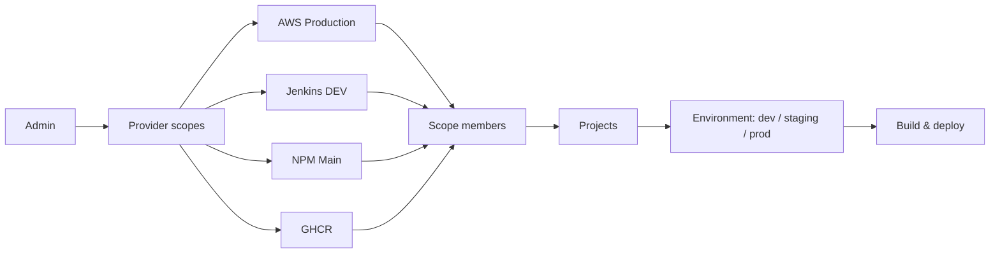
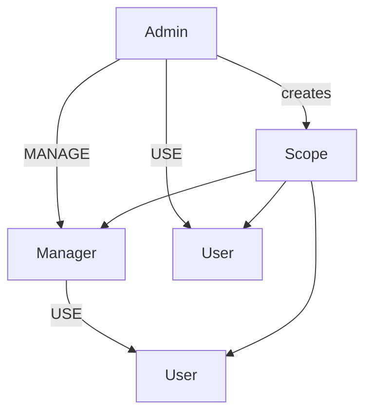
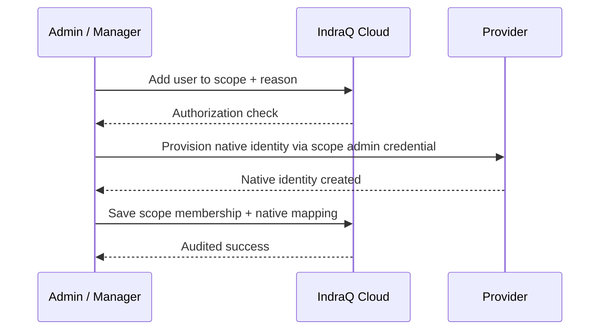
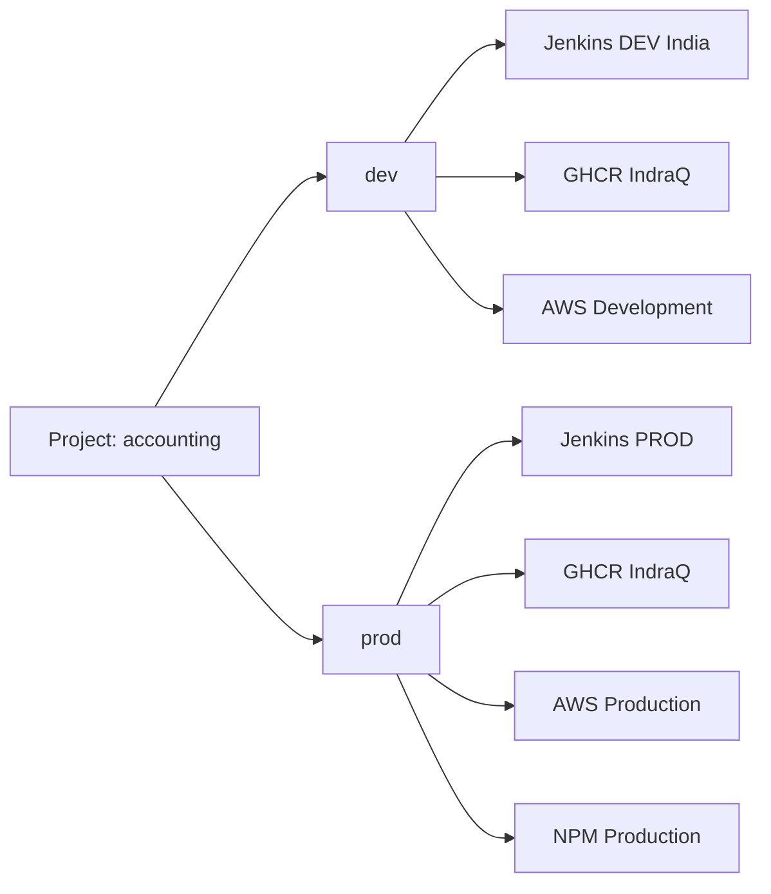
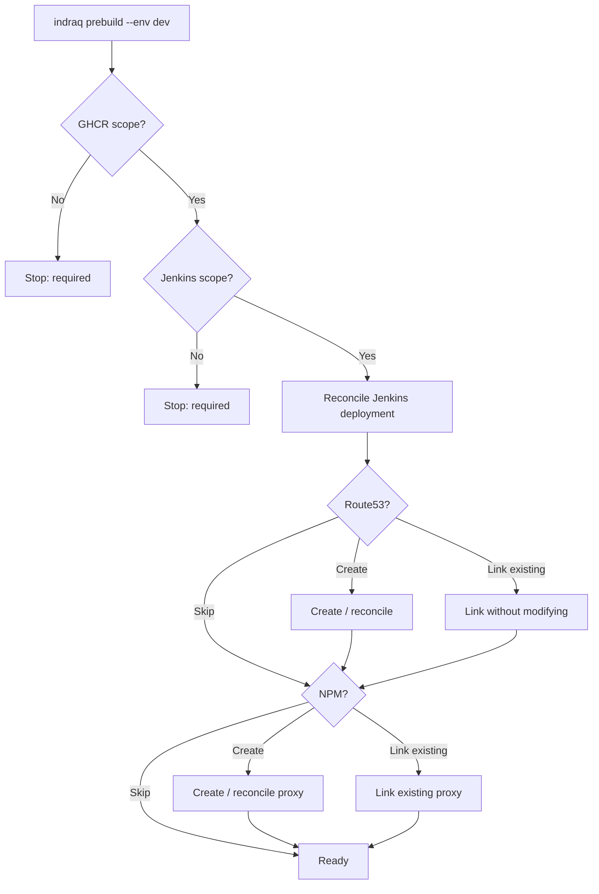
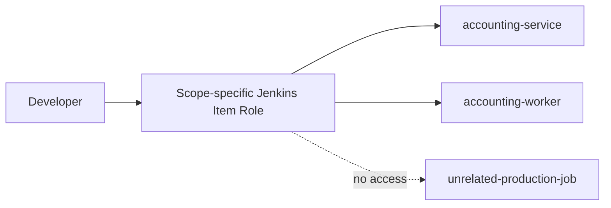

<div align="center">
  

  # IndraQ CLI

  **One CLI for provider access, project infrastructure and deployments.**

  
  
  
  

  **[Quick start](#quick-start)** · **[Scopes](#provider-scopes)** · **[Users](#users-and-permissions)** · **[Projects](#projects-and-environments)** · **[Deploy](#prebuild-and-deploy)** · **[Commands](#command-reference)**
</div>

---

## What is IndraQ?

IndraQ is an internal engineering CLI that connects your team to shared infrastructure without making every developer carry organization administrator credentials.

Instead of configuring “one AWS”, “one Jenkins”, or “one NPM” globally, v2.1 introduces **provider scopes**. A scope is one named account or server such as:

- `AWS — IndraQ Production`
- `AWS — Client ABC`
- `Jenkins DEV — India`
- `Jenkins PROD — Production`
- `NPM — Main Reverse Proxy`
- `GHCR — IndraQ`

Admins create scopes once. Managers assign users inside scopes they manage. Users see and use only scopes assigned to them.



> [!TIP]
> The Cloud API is built into the CLI at **https://cli.indraq.com**. Provider secrets are stored centrally and encrypted; project folders store only project references, not administrator secrets.

---

## Why scopes?

Teams often manage several servers, customers and cloud accounts at once. A single provider credential creates ambiguity and unnecessary privilege. Scopes solve both problems.

| Problem | v2.1 behavior |
|---|---|
| Several AWS accounts | Unlimited named AWS scopes |
| Several Jenkins servers | Unlimited named DEV/PROD Jenkins scopes |
| Several NPM servers | Unlimited named NPM scopes |
| “Which account is this?” | `scope describe` shows safe identifying metadata |
| Users should not see every server | Only assigned scopes are visible |
| Managers should not create org credentials | Only admins create scopes |
| Project needs a specific provider | Project/environment links override personal defaults |
| Existing DNS/proxy should be reused | Link existing or skip |

---

## Core concepts

### Provider scope

One organization-owned provider account/server plus its encrypted management credential and safe metadata.

### Scope membership

A relationship between a person and a scope:

- `USE` — consume the scope and self-manage only your own credentials.
- `MANAGE` — add/remove normal users and manage membership in that scope.

### Project

A durable application definition. Deleting a developer does **not** delete the project, Jenkins jobs, DNS, proxy configuration or image associations.

### Environment

An IndraQ deployment/resource environment such as `dev`, `staging` or `prod`.

> [!IMPORTANT]
> `--env dev` selects the **IndraQ project/resource environment**. It does **not** load `.env.dev`, `.env`, or any application environment file.

---

## Users and permissions

| Capability | Admin | Manager | User |
|---|:---:|:---:|:---:|
| Create/delete provider scopes | ✅ | ❌ | ❌ |
| View assigned scopes | ✅ | ✅ | ✅ |
| Describe assigned scopes safely | ✅ | ✅ | ✅ |
| Grant `MANAGE` to a manager | ✅ | ❌ | ❌ |
| Add/remove normal users in managed scope | ✅ | ✅ | ❌ |
| Create manager/admin organization roles | ✅ | ❌ | ❌ |
| Change organization roles | ✅ | ❌ | ❌ |
| Set personal provider default | ✅ | ✅ | ✅ |
| Rotate own AWS access key | ✅ | ✅ | ✅ |
| Rotate own NPM/Jenkins password | ✅ | ✅ | ✅ |
| Raw provider administration | ✅ | ❌ | ❌ |

Managers can operate only inside scopes where they have `MANAGE`. A manager assigned only to `AWS — Production` cannot manage users in `AWS — Client ABC`.



All membership changes require an audit reason and are written to the Cloud audit log.

---

## Quick start

### 1. Install

```bash
npm install -g indraq_cli
indraq --version
```

Node.js 22+ is required.

### 2. Login

```bash
indraq login
indraq whoami
```

### 3. Admin creates organization scopes

```bash
indraq scope create aws
indraq scope create jenkins-dev
indraq scope create npm
indraq scope create ghcr
```

You can create as many as required.

### 4. Verify what a scope represents

```bash
indraq scope list
indraq scope describe "AWS Production"
```

Example safe output:

```text
provider      AWS
name          Production
company       IndraQ
account       123456789012
region        ap-south-1
username      indraq-admin
access        use
default       yes
credentials   stored securely (secret hidden)
```

`describe` never prints passwords, tokens, AWS secret keys or GHCR tokens.

### 5. Create a user and choose scopes

```bash
indraq user create
```

The admin/manager sees only scopes they can manage and can select multiple:

```text
[✓] AWS — Production
[ ] AWS — Client ABC
[✓] Jenkins DEV — India
[✓] NPM — Main
[✓] GHCR — IndraQ
```

Native AWS/NPM/Jenkins identities are created only in selected scopes.

### 6. Link a project

Register an existing application folder without scaffolding source code or running `npm install`:

```bash
indraq project create cloud-api --kind backend --framework express --port 4010 --health /health
# or link this folder to an already registered project
indraq project link
```

`indraq project create` does **not** scaffold source code, run `npm install`, generate Docker files, or create cloud infrastructure. It only registers the existing folder and writes the local `.indraq/project.json` reference.

### 7. Choose project provider defaults

```bash
indraq project scopes --env dev
```

A project may use a different scope than your personal default.

### 8. Reconcile infrastructure

```bash
indraq prebuild --env dev
```

### 9. Deploy

```bash
indraq deploy:dev
# or
indraq deploy build --env staging
```

---

## Provider scopes

### Unlimited named scopes

```text
AWS Production ★
AWS Development
AWS Client ABC

Jenkins DEV India ★
Jenkins DEV Client ABC

NPM Main ★
NPM Europe

GHCR IndraQ ★
```

A star is conceptually the current user's default for that provider type. Defaults are per user.

```bash
indraq scope default aws
indraq scope default npm
indraq scope default jenkins-dev
indraq scope default ghcr
```

### Add an existing user to a scope

```bash
indraq scope add-user
```

This performs both sides of the operation:



### Remove a user

```bash
indraq scope remove-user
```

The provider-native identity is removed first. Cloud membership is removed after successful provider cleanup.

### Audit a scope

```bash
indraq scope audit
```

You can review who added/removed users, changed access, resolved credentials or rotated managed values and why.

---

## Personal credential self-service

Users do not administer organization scopes, but they can manage their own identities inside assigned scopes.

### AWS

```bash
indraq scope credentials
indraq scope rotate-key
```

If several AWS scopes are assigned, IndraQ asks which account to use.

### NPM / Jenkins

```bash
indraq scope rotate-password
```

The selected NPM/Jenkins scope is updated without exposing the organization administrator password/token.

---

## Projects and environments

A project can bind scopes by environment:



Use:

```bash
indraq project scopes --env dev
indraq project scopes --env prod
```

**Jenkins and GHCR are required** for deployment. AWS and NPM scope links are optional because not every project needs IndraQ-managed DNS or reverse proxy.

---

## Prebuild and deploy

`prebuild` reconciles the project before deployment.



### Required

- GHCR image association
- Jenkins deployment/pipeline association

### Optional Route53

- **Skip** — deploy without IndraQ-managed DNS.
- **Create / reconcile** — create or repair a managed Route53 record.
- **Link existing** — select an existing record and record the association without modifying it.

### Optional NPM

- **Skip** — deploy without IndraQ-managed reverse proxy.
- **Create / reconcile** — create or repair an NPM proxy host.
- **Link existing** — select an existing proxy and associate it without modifying it.

This is useful for projects that existed before IndraQ or where DNS/proxy is managed elsewhere.

---

## What `--env` means

```bash
indraq deploy build --env dev
indraq deploy build --env staging
indraq deploy build --env prod
```

The flag selects **IndraQ resource state**:

```text
project
└── dev
    ├── Jenkins scope + job
    ├── GHCR scope + image
    ├── optional AWS/DNS resource
    └── optional NPM proxy resource
```

It does not select application files such as `.env.dev`. Your Dockerfile/build configuration remains responsible for application environment variables.

`dev`, `staging`, `qa` and other non-production names use the development Jenkins family. `prod`/`production` use the production Jenkins family.

---

## Jenkins access model

IndraQ requires the Jenkins **Role Strategy** authorization strategy for managed access.

Global roles provide minimal base identity permissions. **Item Roles** grant access to exact project pipelines.

Example:

```text
Role: indraq-<user>-<scope>
Pattern: ^(?:accounting-service|accounting-worker)$

Permissions
  Job/Discover   ✓
  Job/Read       ✓
  Job/Build      ✓
  Job/Cancel     ✓
  Job/Workspace  ✓
  Job/Configure  ✗
  Overall/Admin  ✗
```



When project access changes, IndraQ rebuilds the user's Item Role from their remaining grants.

---

## User lifecycle

### Create

```text
Cloud identity
→ selected AWS identities
→ selected NPM identities
→ selected Jenkins identities
→ scope memberships
```

If provider provisioning fails, IndraQ attempts rollback instead of leaving a half-created user.

### Role change

Admins can promote/demote organization roles:

```bash
indraq user update rajvir --role manager
indraq user update rajvir --role user
```

Promotion does not silently grant MANAGE to unrelated scopes. Demotion to `user` downgrades MANAGE memberships to USE and synchronizes provider-native role state.

### Delete

```bash
indraq user delete rajvir
```

Provider identities are removed first. Cloud identity is deleted last. Projects and infrastructure remain.

---

## Command reference

### Authentication and diagnostics

| Command | Use |
|---|---|
| `indraq login` | Sign in |
| `indraq logout` | Remove local Cloud token |
| `indraq whoami` | Show current identity |
| `indraq doctor` | Diagnose Node/Java/Git/tar/PATH |
| `indraq logs` | Audit/log access where permitted |

### Scopes

| Command | Use |
|---|---|
| `indraq scope list` | List assigned scopes |
| `indraq scope describe [nameOrId]` | Safe scope identity/details |
| `indraq scope create [provider]` | Admin creates organization scope |
| `indraq scope delete [nameOrId]` | Admin deletes unused scope |
| `indraq scope members` | List members of manageable scope |
| `indraq scope add-user` | Add/provision user |
| `indraq scope remove-user` | Remove/deprovision user |
| `indraq scope default [provider]` | Personal provider default |
| `indraq scope audit` | Scope audit trail |
| `indraq scope credentials` | Own AWS credential |
| `indraq scope rotate-key` | Rotate own AWS access key |
| `indraq scope rotate-password` | Rotate own NPM/Jenkins password |

### Users

| Command | Use |
|---|---|
| `indraq user list` | List organization users |
| `indraq user create [username]` | Create user + select scopes |
| `indraq user update [username]` | Password/role operations |
| `indraq user delete [username]` | Hard delete after scope cleanup |
| `indraq password reset` | Self-service Cloud password reset |

### Projects and access

| Command | Use |
|---|---|
| `indraq init [directory]` | Initialize/link project |
| `indraq project create [name]` | Register existing project |
| `indraq project list` | List accessible projects |
| `indraq project link` | Link current folder |
| `indraq project status` | Show project resources |
| `indraq project scopes --env <env>` | Select project provider scopes |
| `indraq project add user` | Add project member + synchronize access |
| `indraq project delete user` | Remove project member |
| `indraq access add user` | Add selected resource grants |
| `indraq access delete user` | Remove selected resource grants |

### Deploy and Jenkins

| Command | Use |
|---|---|
| `indraq prebuild --env <env>` | Reconcile infrastructure |
| `indraq deploy:dev` | Dev deploy |
| `indraq deploy:prod` | Prod deploy |
| `indraq deploy build --env <env>` | Named environment deploy |
| `indraq jenkins pipelines --stage dev` | List visible pipelines |
| `indraq jenkins run [job] --stage dev` | Run pipeline with discovered parameters |
| `indraq jenkins create-deployment` | Bootstrap deployment pipeline |

### AWS / DNS / NPM advanced administration

Raw organization administration commands are intentionally admin-restricted. Normal users should use scope self-service commands.

```bash
indraq iam users
indraq iam user:create alice
indraq dns zones
indraq dns records
indraq healthcheck list
indraq npm-user create
indraq proxy create api.example.com
```

---

## Common workflows

### Admin adds a new customer server

```bash
indraq scope create aws
indraq scope create jenkins-dev
indraq scope create npm
indraq scope describe
indraq scope add-user
```

### Manager adds a developer to an existing scope

```bash
indraq scope add-user
```

The manager can choose only a scope where they already have MANAGE access and can add only a normal user.

### Developer checks the account before deployment

```bash
indraq scope list
indraq scope describe "AWS Client ABC"
indraq project scopes --env dev
indraq prebuild --env dev
indraq deploy:dev
```

### Existing project already has DNS/NPM

```bash
indraq prebuild --env dev
```

Choose **Link existing** for the resources you want recorded in IndraQ, or **Skip** if IndraQ should not manage them.

---

## Security model

> [!WARNING]
> Scope descriptions are intentionally safe, but provider scope administration is privileged. Do not paste secrets, generated access keys, API tokens or temporary passwords into tickets or chat.

Key rules:

- Provider scopes are visible only to members.
- Only admins create organization credentials/scopes.
- Managers can manage only normal users inside scopes where they hold MANAGE.
- Users rotate only their own provider identities.
- Every sensitive resolve/membership operation is audited.
- Cloud deletion happens after external provider cleanup.
- Jenkins project access uses least-privilege Item Roles.
- Project definitions/infrastructure survive user deletion.

---

## Troubleshooting

### `fetch failed` while configuring NPM

v2.1 surfaces the underlying network/TLS/authentication error where possible. Verify the URL uses the correct scheme and hostname, then compare with the web login. A browser login does not necessarily prove Node.js trusts the same TLS certificate chain.

### Jenkins says Role Strategy is not active

Go to **Manage Jenkins → Security → Authorization** and select **Role-Based Strategy**. The administrator credential stored in the Jenkins scope needs `Overall/Administer` so IndraQ can manage users/roles.

### User cannot see a provider account

That is expected unless the user is a scope member:

```bash
indraq scope add-user
```

### Deploy says Jenkins/GHCR is missing

Those two are mandatory. Add the user to the required scope and link/select it:

```bash
indraq project scopes --env dev
```

### DNS is missing but deployment should continue

Run prebuild and choose **Skip** for Route53.

---

## Cloud API upgrade for v2.1

The CLI and Cloud API must be upgraded together.

Apply migrations through:

```text
cloud-api/sql/001_*.sql
...
cloud-api/sql/008_provider_scopes.sql
```

Then build/restart the Cloud API. The v2.1 migration adds provider scopes, memberships, personal defaults, project/environment bindings and scope-native identity mappings.

See [UPGRADE_v2.0_to_v2.1.md](UPGRADE_v2.0_to_v2.1.md) for the release checklist.

---

## Development and release

```bash
npm install
npm run build
npm test
npm pack --dry-run
```

Cloud API:

```bash
npm --prefix cloud-api install
npm --prefix cloud-api run build
```

---

<div align="center">
  

  **IndraQ CLI v2.1.0**

  Scope-based infrastructure access. Durable projects. Safer deployments.
</div>
