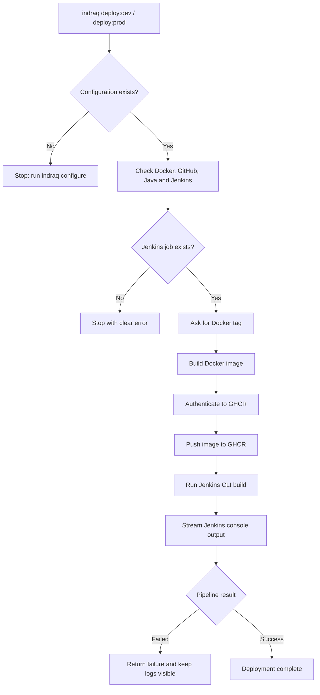

<p align="center">
  
</p>

<h1 align="center">IndraQ CLI</h1>

<p align="center">
  <strong>One command-line tool for IndraQ engineering operations.</strong>
</p>

<p align="center">
  Build Docker images · Push to GHCR · Run Jenkins pipelines · Stream deployment logs
</p>

<p align="center">
  
  
  
  
  
</p>

> [!IMPORTANT]
> **IndraQ CLI is built for IndraQ Innovations engineering operations and is publicly distributed on npm.** Anyone can install and use it with compatible Docker, GitHub/GHCR, and Jenkins infrastructure. The deployment module is the first module; more tools can be added without turning the project into one giant script.

---

## Index

1. [What are we building?](#what-are-we-building)
2. [Explain it like I am new](#explain-it-like-i-am-new)
3. [What happens during deployment?](#what-happens-during-deployment)
4. [Requirements](#requirements)
5. [Install Java 21](#install-java-21)
6. [Install the CLI](#install-the-cli)
7. [First-time configuration](#first-time-configuration)
8. [Change configuration later](#change-configuration-later)
9. [Deploy development](#deploy-development)
10. [Deploy production](#deploy-production)
11. [Jenkins setup and rules](#jenkins-setup-and-rules)
12. [GitHub and GHCR](#github-and-ghcr)
13. [Where configuration and secrets live](#where-configuration-and-secrets-live)
14. [Command reference](#command-reference)
15. [Project architecture](#project-architecture)
16. [Common errors](#common-errors)
17. [Frequently asked questions](#frequently-asked-questions)
18. [Final checklist](#final-checklist)
19. [Future modules](#future-modules)
20. [Publishing and npm organization management](#publishing-and-npm-organization-management)
21. [License](#license)

---

## What are we building?

IndraQ CLI is a small program that runs inside your terminal. Instead of remembering many Docker, GitHub, GHCR, and Jenkins commands, you tell **IndraQ CLI what you want**, and it performs the boring steps for you.

Today it handles deployment:

```text
Your project
   │
   ├── Dockerfile
   │
   └── indraq deploy:dev
            │
            ├── check Docker / GitHub / Java / Jenkins
            ├── build Docker image
            ├── push image to GHCR
            ├── find matching Jenkins job
            ├── start Jenkins build
            └── show Jenkins logs in this terminal
```

The goal is not to make one huge deployment script. The goal is to build a **modular engineering CLI platform** where future commands can live beside deployment cleanly.

---

## Explain it like I am new

Imagine you made a school project and want to put the new version on a server.

Without IndraQ CLI, you may need to remember a long list of commands: build an image, log in to GitHub's registry, push the image, open Jenkins, find the correct pipeline, start it, and then watch the logs.

With IndraQ CLI, after one-time setup you type:

```bash
indraq deploy:dev
```

The CLI does the sequence for you. If something is wrong, it stops and tells you what is wrong instead of silently continuing.

### The three names you should remember

| Thing | Simple meaning |
|---|---|
| **Docker image** | A packaged copy of your application |
| **GHCR** | GitHub's place for storing Docker images |
| **Jenkins pipeline/job** | The automation that deploys or processes your image |

---

## What happens during deployment?



The Jenkins job name is intentionally simple:

> **Jenkins job name = configured image name**

Example:

```text
Image name:              immortality-accounting-service
Expected Jenkins job:    immortality-accounting-service
GHCR image:              ghcr.io/indraq-innovations/immortality-accounting-service
```

If Jenkins does not contain that job, deployment stops before building the Docker image.

---

## Requirements

Install these before using the deployment module.

| Requirement | Why it is needed | Quick check |
|---|---|---|
| **Node.js 24** | Runs IndraQ CLI | `node --version` |
| **npm** | Installs the CLI | `npm --version` |
| **Git** | Detects your GitHub authentication | `git --version` |
| **Docker** | Builds and pushes images | `docker --version` |
| **Java** | Runs `jenkins-cli.jar` | `java -version` |
| **Jenkins account** | Starts your pipeline | Jenkins username + API token/password |

> [!TIP]
> Jenkins accepts passwords for the CLI in many configurations, but an **API token is strongly preferred**. Treat the prompt `API token or password` as "paste your Jenkins API token here" whenever possible.

### Java is not optional

Jenkins provides its CLI as a Java `.jar` file. IndraQ CLI downloads that file from your Jenkins server, so your computer must be able to run:

```bash
java -version
```

If that command is not found, **do not continue to `indraq configure` yet**. Install Java first using the next section.

> [!IMPORTANT]
> **IndraQ standard: Java 21 LTS.** Jenkins applies its Java support policy to CLI clients as well as controllers and agents. Standardizing every IndraQ developer machine on Java 21 avoids different developers running different Java versions.

---

## Install Java 21

You only need to do this once on each developer machine.

### Windows — recommended method

Open **PowerShell** or **Windows Terminal** and install Eclipse Temurin 21:

```powershell
winget install EclipseAdoptium.Temurin.21.JDK
```

When installation finishes, **close VS Code and all terminal windows, then reopen them**. This is important because an already-open terminal may still have the old `PATH`.

Verify Java:

```powershell
java -version
```

A successful result should begin with Java 21, for example:

```text
openjdk version "21..."
```

Also verify where Windows found Java:

```powershell
where.exe java
```

You should see a Java installation path instead of an error.

#### If `winget` is unavailable

Download a **Java 21 JDK** installer from Eclipse Adoptium / Temurin and install it. During setup, enable the options that add Java to `PATH` and set `JAVA_HOME` when available.

Official installation documentation:

- https://adoptium.net/installation/windows
- https://learn.microsoft.com/windows/dev-environment/java

#### If Java is installed but `java -version` still fails

First restart VS Code / your terminal. If it still fails, check:

```powershell
$env:JAVA_HOME
$env:Path
where.exe java
```

If needed, set `JAVA_HOME` to your Java 21 installation folder and add `%JAVA_HOME%\bin` to the Windows system `Path`.

Example installation location:

```text
C:\Program Files\Eclipse Adoptium\jdk-21...
```

Then reopen the terminal and verify again:

```powershell
java -version
javac -version
```

### Ubuntu / Debian

Install OpenJDK 21:

```bash
sudo apt update
sudo apt install -y openjdk-21-jdk
```

Verify:

```bash
java -version
javac -version
```

If more than one Java version is installed, check/select the active version with:

```bash
sudo update-alternatives --config java
```

### macOS

If Homebrew is installed:

```bash
brew install --cask temurin@21
```

Then reopen the terminal and verify:

```bash
java -version
```

### Final Java check

Do not continue until this works:

```bash
java -version
```

Then run:

```bash
indraq configure
```

IndraQ CLI will perform the Java check again before downloading and starting `jenkins-cli.jar`.

---

## Install the CLI

IndraQ CLI is published as the public npm package **`indraq_cli`**. Install it globally once:

```bash
npm install -g indraq_cli
```

Then verify the command:

```bash
indraq --version
indraq --help
```

You should now be able to use `indraq` from any project folder:

```bash
indraq configure
indraq deploy:dev
indraq deploy:prod
```

### Update to the newest version

```bash
npm update -g indraq_cli
```

Then confirm the installed version:

```bash
indraq --version
```

### Uninstall

```bash
npm uninstall -g indraq_cli
```

### If `indraq` is not found after installation

First check where npm installs global commands:

```bash
npm prefix -g
```

On Windows, also run:

```powershell
where.exe indraq
```

On macOS/Linux:

```bash
which indraq
```

If another file or program is found before the npm launcher, run `indraq doctor` if the CLI is reachable by another terminal/session, or fix the conflicting PATH entry.

### Developing the CLI itself

Contributors working on the IndraQ CLI source can still use:

```bash
npm ci
npm run build
npm link
```

`npm link` is for CLI development only. Normal users should install the published package with `npm install -g indraq_cli`.

---

## First-time configuration

Go to the **application repository you want to deploy**, not the IndraQ CLI source repository.

Example:

```bash
cd C:\Projects\my-service
indraq configure
```

On the **first run only**, IndraQ CLI does a complete setup because the project does not have a finished deployment configuration yet.

```text
indraq configure
      │
      ├── choose environment
      ├── configure image name
      ├── connect and verify Jenkins
      ├── choose GitHub / GHCR destination
      ├── choose Dockerfile
      └── save configuration
```

After this first successful setup, `indraq configure` changes behavior. It does **not** make you enter everything again. See [Change configuration later](#change-configuration-later).

### Step 1 - Choose environment

```text
? Select the environment you want to configure:
> Development
  Production
```

Development is stored as `dev`; production is stored as `prod`.

### Step 2 - Enter image name

Example:

```text
? Enter image name for DEV environment:
immortality-accounting-service
```

This name is important because the CLI also looks for a Jenkins job with **the same name**.

### Step 3 - Connect Jenkins

You enter:

```text
Jenkins URL/domain
Jenkins username
Jenkins API token or password
```

Example Jenkins URL:

```text
https://jenkins.example.com
```

IndraQ CLI then performs these checks automatically:

```text
1. Is Java available?
2. Can the CLI download /jnlpJars/jenkins-cli.jar?
3. Can these credentials authenticate?
4. Does Jenkins CLI `who-am-i` identify a real user?
5. Does WebSocket mode work? If not, can HTTP CLI mode work?
```

If the credentials are wrong, configuration **fails immediately**. Bad Jenkins credentials are not silently saved.

> [!NOTE]
> The Jenkins connection is currently **project-level**. Development and Production share the same Jenkins controller/account, while each environment can have its own image/job name.

### Step 4 - Choose GitHub destination

You choose:

```text
Personal GitHub account
or
GitHub organization
```

If you select an organization, the CLI shows the organizations available to your authenticated GitHub account.

Example:

```text
? Where do you want to push the GHCR image? Organization
? Select a GitHub organization: IndraQ-Innovations
```

> [!NOTE]
> The GitHub/GHCR destination is currently **project-level** and is shared by Development and Production.

### Step 5 - Choose Dockerfile

Usually choose the normal file:

```text
Dockerfile
```

If your Dockerfile has another path, select the custom-path option.

The Dockerfile path is stored separately for Development and Production.

---

## Change configuration later

This is the normal behavior after the project has already been configured once.

Run:

```bash
indraq configure
```

First choose the environment you want to work on:

```text
? Select the environment you want to configure:
> Development
  Production
```

Then IndraQ CLI shows a **settings menu** instead of replaying the whole setup wizard:

```text
? What do you want to configure for Development?
> Image name                (immortality-accounting-service)
  Jenkins connection        (https://jenkins.example.com (harry)) [shared]
  GitHub / GHCR destination (organization: indraq-innovations) [shared]
  Dockerfile path           (Dockerfile)
  ─────────────────────────────────────────────────────────────
  Review current configuration
  Exit configuration
```

Choose **only the setting you actually want to change**.

For example, if you only want to change the Dockerfile:

```text
Dockerfile path
    ↓
change Dockerfile
    ↓
save only that change
    ↓
return to the settings menu
```

The other settings are left untouched.

### The menu stays open until you exit

After every successful change, IndraQ CLI saves it and returns you to the same menu:

```text
Change image name
      ↓
Saved
      ↓
Settings menu
      ↓
Change GitHub destination
      ↓
Saved
      ↓
Settings menu
      ↓
Exit configuration
```

This lets you update several settings in one session without running `indraq configure` again and again.

If you are finished, choose:

```text
Exit configuration
```

### Review without changing anything

Choose:

```text
Review current configuration
```

The CLI shows the selected environment's non-secret settings, including:

```text
Environment
Image name
Dockerfile path
GHCR destination
Jenkins URL
Jenkins username
Expected Jenkins job name
```

The Jenkins API token/password is **never printed**.

### What is environment-specific and what is shared?

| Setting | Development / Production separate? |
|---|---|
| Image name | **Yes** |
| Dockerfile path | **Yes** |
| Jenkins connection | No — shared by the project |
| GitHub / GHCR destination | No — shared by the project |
| Jenkins API token/password | No — tied to the saved Jenkins account and kept outside the project config |

If you change a setting marked **`[shared]`**, that change affects deployments for both Development and Production.

---

## Deploy development

Use either command:

```bash
indraq deploy:dev
```

or the long alias:

```bash
indraq deploy:development
```

The CLI checks the **development** configuration, builds the configured image, pushes it to GHCR, and starts the Jenkins job with the same image name.

You will be asked for one or more Docker tags:

```text
? Enter image tags: latest
```

Multiple tags are supported:

```text
latest,dev-2026-08-30
```

---

## Deploy production

Use either:

```bash
indraq deploy:prod
```

or:

```bash
indraq deploy:production
```

A production deployment follows the same protected flow but uses the production environment configuration.

Example:

```text
Environment: PROD
Image: ghcr.io/indraq-innovations/my-service
Tag: 1.8.0
Jenkins job: my-service
```

---

## Jenkins setup and rules

### How Jenkins CLI is obtained

You do **not** manually download a generic Jenkins CLI file.

During `indraq configure`, the CLI downloads the JAR directly from the Jenkins controller you entered:

```text
https://YOUR-JENKINS/jnlpJars/jenkins-cli.jar
```

This keeps the client aligned with that Jenkins controller.

### How credentials are checked

IndraQ CLI uses Jenkins CLI's `who-am-i` command. If Jenkins authenticates the user, setup continues. If authentication fails or Jenkins sees the request as anonymous, configuration stops.

### How a deployment is triggered

After the Docker image is successfully pushed, IndraQ CLI runs the equivalent of:

```text
jenkins-cli.jar build <IMAGE_NAME> -s -v
```

`-s` waits for Jenkins to finish and returns Jenkins' success/failure result. `-v` prints the build console output.

That means the VS Code terminal becomes your Jenkins log window:

```text
Started my-service #142
[Pipeline] Start of Pipeline
[Pipeline] stage
[Pipeline] { (Deploy)
...
Finished: SUCCESS
Completed my-service #142 : SUCCESS
```

If Jenkins fails, the CLI also fails and leaves the Jenkins error output visible above it.

### Required Jenkins permissions

The Jenkins user must be allowed to:

- authenticate to Jenkins CLI;
- read the target job;
- trigger/build the target job;
- view the build output needed by the CLI.

If Jenkins returns `403`, ask the Jenkins administrator to check permissions for that account.

### Job naming rule

For now, IndraQ CLI deliberately uses a zero-mapping rule:

```text
Docker image name == Jenkins job name
```

This avoids hidden routing tables and webhook payload rules.

---

## GitHub and GHCR

IndraQ CLI accepts normal Git/Git Bash authentication and does **not** require GitHub CLI (`gh`).

It can use:

- Git Credential Manager / HTTPS credentials;
- GitHub CLI credentials when available;
- GitHub SSH authentication for Git operations.

GHCR does not accept SSH keys as registry credentials. If your GitHub session is SSH-only, Docker may still require a one-time registry login:

```bash
docker login ghcr.io
```

Your final image looks like:

```text
ghcr.io/<owner>/<image>:<tag>
```

Example:

```text
ghcr.io/indraq-innovations/immortality-accounting-service:latest
```

---

## Where configuration and secrets live

### Project configuration

Each application gets:

```text
<your-project>/.indraq/deploy.json
```

Example:

```json
{
  "schemaVersion": 2,
  "github": {
    "ownerType": "organization",
    "owner": "IndraQ-Innovations"
  },
  "jenkins": {
    "url": "https://jenkins.example.com",
    "username": "developer",
    "serverId": "8be77a9980d4c19a",
    "connectionMode": "webSocket"
  },
  "environments": {
    "dev": {
      "name": "Development",
      "imageName": "my-service-dev",
      "dockerfilePath": "Dockerfile"
    },
    "prod": {
      "name": "Production",
      "imageName": "my-service",
      "dockerfilePath": "Dockerfile"
    }
  }
}
```

Notice what is **not** there: your Jenkins API token/password.

### Jenkins CLI cache and secret

Jenkins runtime files are kept under the user's home directory:

```text
~/.indraq/jenkins/<server-id>/
├── jenkins-cli.jar
└── auth
```

The `auth` file is passed to Jenkins CLI using its credential-file mechanism instead of putting the secret directly into the Java command line.

> [!CAUTION]
> This is still a local secret. Never copy the `auth` file into a repository, chat message, ticket, or documentation. On shared computers, use a dedicated OS account and prefer Jenkins API tokens with limited permissions.

The project-local `.indraq` folder also gets a `.gitignore` so its local state is not accidentally committed.

---

## Command reference

### Normal commands

| Command | What it does |
|---|---|
| `indraq --version` | Show installed CLI version |
| `indraq --help` | Show available commands |
| `indraq configure` | First run: complete setup. Later runs: open the environment settings menu |
| `indraq deploy:dev` | Deploy development |
| `indraq deploy:development` | Same as `deploy:dev` |
| `indraq deploy:prod` | Deploy production |
| `indraq deploy:production` | Same as `deploy:prod` |

### Structured commands

These are kept for automation and discoverability:

```bash
indraq deploy configure
indraq deploy build --env dev
indraq deploy build --env development
indraq deploy build --env prod
indraq deploy build --env production
```

---

## Project architecture

IndraQ CLI is module-based from day one:

```text
src/
├── index.ts
├── cli/
│   └── create-program.ts
├── modules/
│   └── deploy/
│       ├── commands/
│       │   ├── configure.command.ts
│       │   └── build.command.ts
│       ├── config/
│       │   └── deployment-config.ts
│       └── services/
│           ├── docker.service.ts
│           └── jenkins.service.ts
└── shared/
    ├── git/
    └── github/
```

The rule is simple:

> A future feature should become a module, not another giant block inside deployment.

For example:

```text
src/modules/database/
src/modules/backup/
src/modules/server/
src/modules/secrets/
src/modules/diagnostics/
```

---

## Common errors

### `Java is required for Jenkins CLI but was not found`

IndraQ CLI cannot run `jenkins-cli.jar` without Java.

Check:

```bash
java -version
```

If that command fails, install **Java 21 LTS** using the [Install Java 21](#install-java-21) section above. On Windows, the quickest supported path is:

```powershell
winget install EclipseAdoptium.Temurin.21.JDK
```

After installation, completely close and reopen VS Code / the terminal and run:

```powershell
java -version
where.exe java
```

Only retry `indraq configure` after Java is visible in the new terminal.

### `Jenkins authentication failed`

Check all three values:

```text
Jenkins URL
Jenkins username
Jenkins API token/password
```

Prefer creating a fresh Jenkins API token and running:

```bash
indraq configure
```

Choose the environment, select **Jenkins connection**, and enter the new credentials.

### `No Jenkins pipeline/job named "my-service" was found`

Your configured image name and Jenkins job name do not match.

If configuration says:

```text
imageName = my-service
```

Jenkins must contain:

```text
my-service
```

Either rename/create the Jenkins job or run `indraq configure`, choose the environment, and change **Image name** to the correct Jenkins job name.

### `Jenkins denied access`

The user authenticated successfully but does not have enough permission for that job. Ask the Jenkins administrator to check the account's read/build permissions.

### `Docker is not installed or is not accessible`

Check:

```bash
docker --version
docker info
```

Make sure Docker Desktop / Docker Engine is running.

### GHCR push is denied

Your GitHub credential may not have package write access for the selected owner/organization.

If you use SSH-only Git authentication, also try:

```bash
docker login ghcr.io
```

### `indraq` opens the wrong Windows program

Run:

```powershell
where.exe indraq
```

If another program appears before npm's launcher, Windows has a command-name collision. Remove/rename the unrelated launcher or correct PATH ordering.

---

## Frequently asked questions

### Do I need the Generic Webhook Trigger plugin now?

No. The deployment flow no longer depends on a generic webhook URL. IndraQ CLI talks directly to Jenkins using Jenkins CLI.

### Do I need to download `jenkins-cli.jar` myself?

No. The first-time setup or the **Jenkins connection** option inside `indraq configure` downloads the JAR from the Jenkins server you entered.

### Do I have to install GitHub CLI (`gh`)?

No. Normal Git/Git Bash authentication is supported. `gh` is optional.

### Can I use a Jenkins password?

The CLI accepts an API token or password, subject to your Jenkins security configuration. An API token is the safer choice and is recommended.

### Where can I see Jenkins build logs?

Directly in the same terminal where you ran:

```bash
indraq deploy:dev
```

The deployment command waits for Jenkins and streams its console output.

### What happens if Jenkins fails?

The command exits as failed. The Docker image may already be in GHCR because Jenkins is intentionally triggered **after** a successful image push. The Jenkins error remains visible in your terminal for debugging.

### What if the Jenkins job does not exist?

The CLI checks before building the Docker image and stops with a clear error.

### Why does Jenkins job name have to equal image name?

It keeps the first deployment system predictable. A developer can know the expected pipeline name without searching a mapping file or webhook configuration.

### Can development and production have different image names?

Yes. Image names and Dockerfile paths are environment-specific.

Run:

```bash
indraq configure
```

Select Development or Production, then change only the setting you need from the configuration menu. When you are done, choose **Exit configuration**.

### Can both environments use the same Jenkins server?

Yes. Jenkins server configuration is project-level; each environment's image name decides which matching job is triggered.

### Are Jenkins secrets stored in `deploy.json`?

No. The project config contains the Jenkins URL, username, server ID, and connection mode. The secret is stored separately in the local IndraQ cache.

---

## Final checklist

Before calling a machine ready for IndraQ deployments, confirm:

- [ ] Node.js 24 is installed.
- [ ] `indraq --version` works.
- [ ] Git authentication works.
- [ ] Docker is installed and running.
- [ ] Java is installed and `java -version` works.
- [ ] First-time `indraq configure` completes successfully.
- [ ] Running `indraq configure` again opens the selective settings menu instead of the full wizard.
- [ ] Jenkins credentials pass the `who-am-i` check.
- [ ] The correct GitHub personal account or organization is selected.
- [ ] Development image name matches its Jenkins job name.
- [ ] Production image name matches its Jenkins job name.
- [ ] The project has the expected Dockerfile.
- [ ] The Jenkins user has read/build permission.
- [ ] GHCR push permission exists for the selected owner.
- [ ] `indraq deploy:dev` can build, push, run Jenkins, and show logs.
- [ ] Production is tested deliberately before relying on it for releases.

---

## Future modules

Deployment is only the beginning. The CLI structure is intentionally ready for internal commands such as:

```text
indraq db:backup
indraq db:migrate
indraq server:health
indraq server:deploy
indraq docker:clean
indraq secrets:check
indraq diagnostics
```

These names are examples, not implemented commands yet.

The principle is:

```text
One IndraQ CLI
    ├── deployment operations
    ├── infrastructure operations
    ├── database operations
    ├── diagnostics
    ├── security helpers
    └── future engineering automation
```

---

<p align="center">
  
</p>

<p align="center">
  <strong>Built by IndraQ Innovations for engineering operations.</strong><br/>
  Make repetitive engineering work predictable, visible, and difficult to misuse.
</p>

---

## Windows command popup / command-name collision

If typing `indraq` opens **Choose an app** or produces no CLI output, Windows is resolving another file named `IndraQ` before npm's launcher. This happens before Node or this CLI starts, so application code cannot intercept it.

Run:

```powershell
where.exe indraq
```

The npm launcher should be the first result, normally `C:\Users\<you>\AppData\Roaming\npm\indraq.cmd`.

The published npm package is named `indraq_cli`, but the executable it installs is intentionally named `indraq`. Inspect any path listed before npm's `indraq` launcher. Do **not** delete an unfamiliar file blindly. If it is an old IndraQ test file, rename/remove it and open a new terminal. Then `indraq configure` and `indraq deploy:dev` should work normally.

---

## Publishing and npm organization management

This section is for IndraQ CLI maintainers. Normal users do **not** need these commands.

### Package name and terminal command

The npm package name is:

```text
indraq_cli
```

Users install it with:

```bash
npm install -g indraq_cli
```

The installed terminal command is still:

```bash
indraq
```

The npm package name and the executable name do not have to be identical.

### Before publishing a release

A freshly extracted source archive does not contain `node_modules`. Install the exact development dependencies first so the TypeScript compiler is available:

```bash
npm ci
npm run build
npm publish --dry-run
```

If `npm publish --dry-run` reports `tsc is not recognized`, `npm ci` was not run successfully in that source folder.

Then verify the account that will publish:

```bash
npm whoami
```

For a real release:

```bash
npm publish --access public
```

Unscoped npm packages such as `indraq_cli` are public.

### Let the IndraQ npm organization manage the package

`indraq_cli` stays unscoped so users keep the simple install command `npm install -g indraq_cli`. After the first publish, an npm organization owner/package maintainer can grant an organization team access to this existing package.

In npm's website:

1. Open the **indraq_innovations** organization.
2. Open **Teams**.
3. Open the team that should maintain the CLI (for example, `developers`).
4. Open **Packages**.
5. Choose **Add Existing Package**.
6. Select `indraq_cli`.
7. Give the team **read/write** access if that team should be able to publish future versions.

This gives the organization team management access without changing the public package name or install command.

---

## License

IndraQ CLI is released under the [MIT License](LICENSE). You may use, copy, modify, and distribute it under the terms of that license.

> IndraQ CLI is not affiliated with or endorsed by Jenkins, Docker, GitHub, or npm. Those names belong to their respective owners.
